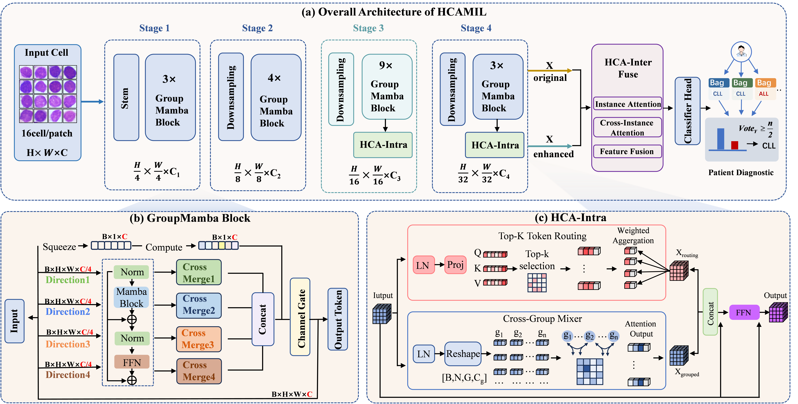

<h2 align="center">HCA-MIL: Hierarchical Cross-Granularity Attention Enhanced Multiple Instance Learning for Leukemia Subtyping</h2>

<p align="center">
  <b>Our work has been accepted by <i>CVPR 2026</i>!<br>
</p>

## Overview
<p align='center'>
    
</p>

**Figure 1. Overview of the proposed HCA-MIL framework.**

**_Abstract -_**  Leukemia subtyping from bone marrow cell images requiresfine-grained discrimination of subtle and heterogeneous cellular patterns,while diagnostic evidence is often distributed across multiple cellular in-stances. Instead of treating each cell independently, we formulate sub-type assessment as patient-level inference from collective cellular evi-dence under a weakly supervised multiple instance learning (MIL) set-ting. Existing MIL approaches mainly rely on direct instance embed-ding aggregation, leaving fine-grained intra-cell morphology and inter-cell population evidence insufficiently modeled. We present HCA-MIL, ahierarchical cross-granularity attentive MIL framework that refines cel-lular representations prior to bag aggregation. With a GroupMamba-based instance encoder, we introduce two complementary branches. Theintra-cell branch enhances diagnostically relevant subcellular structuresthrough sparse token routing and cross-group channel mixing, while theinter-cell fusion branch couples refined cellular morphology with globalbag semantics. In this way, we obtain patient-level representations thatpreserve both local morphological specificity and population-level ev-idence. On a clinical cohort of bone marrow smears, HCA-MIL con-sistently surpasses representative MIL baselines, achieving 95.93% ac-curacy, 99.35% AUC, and 95.89% F1-score across three random seeds.Evaluation on Camelyon+ further supports the transferability of ourcross-granularity aggregation design. Our code is available at https://github.com/lumj1024/HCA-MIL.


### Dataset Preparation
Put the dataset as follows:
```text
Celldeath
├── train
│  ├── 1.npy
│  ├── 2.npy
│  ├── 3.npy
│  ├── ...
├── test
│  ├── 1.npy
│  ├── 2.npy
│  ├── 3.npy
│  ├── ...
```

## Train
Modify the paths in lines 230 to 275 of the train.py, then simply run:

```python
python train.py
```

## Test
Modify the paths in lines 331 to 380 of the test.py, then simply run:

```python
python eval.py
```
